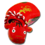

# Header 1

## Header 2

### Header 3

#### Header 4

###### Header 5

 この写真の赤べこは民芸品として有名な福島県ではなく長野県の善光寺にある仲見世通りの土産屋で購入したものです。

[リンク](https://example.com/)です。GFM なら https://example.com/ のように URL も自動的にリンク化されます。

脚注テスト [^1] <span>HTML Span</span>


Here is a footnote reference,[^Z]

[^1]: 脚注テキスト https://akabeko.me/blog/

[^Z]: Here is the footnote.

コードに関係するものはシングル クォーテーションで囲むと `code` のようになります。

ルビが利用できると「"{不運}^(ハードラック)"と"{踊}^(ダンス)"っちまったんだよ...」みたいな表現も可能です。

**Strong 1** __Strong 2__
*Italic 1* _Italic 2_
~~Strike~~

## Header Line

---
***

## Text

「ではみなさんは、そういうふうに川だと云われたり、乳の流れたあとだと云われたりしていたこのぼんやりと白いものがほんとうは何かご承知ですか。」先生は、黒板に吊した大きな黒い星座の図の、上から下へ白くけぶった銀河帯のようなところを指しながら、みんなに問をかけました。

カムパネルラが手をあげました。それから四五人手をあげました。ジョバンニも手をあげようとして、急いでそのままやめました。たしかにあれがみんな星だと、いつか雑誌で読んだのでしたが、このごろはジョバンニはまるで毎日教室でもねむく、本を読むひまも読む本もないので、なんだかどんなこともよくわからないという気持ちがするのでした。

## Quote

> Nest 1
>
> > Nest 2
> >
> > > Nest 3
> > > Nest 3
> >
> > Nest 2
>
> Nest 1

## List

- List
- List
  - List
      - List
      - List
- List
  1. List
  2. List
      1. List
      2. List

1. List
    - List
    - List
2. List
    - List
    - List

## Table

| Normal | Center | Left | Right  |
| ------ | :----: | :--- | -----: |
| A      | A      | A    | A      |
| B      | B      | B    | B      |
| C      | C      | C    | C      |

## Code Block

JavaScript

```js
const value = 'value'
if (value) {
  console.log(value)
}
```

HTML

```html
<!DOCTYPE html>
<html lang="ja">
  <head>
    <meta charset="utf-8" />
    <meta name="viewport" content="width=s, initial-scale=1.0" />
    <meta http-equiv="X-UA-Compatible" content="ie=edge" />
    <title>サンプル</title>
    <link rel="stylesheet" href="main.css" />
  </head>
  <body>
    <article>
      <h1>サンプル</h1>
    </article>
  </body>
</html>
```
